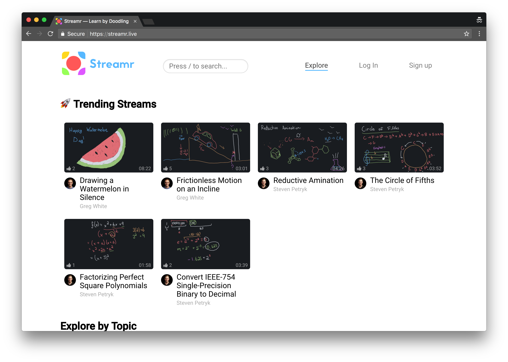

# Streamr Web

[](http://standardjs.com/)
[](https://circleci.com/gh/zebras-filming-videos/streamr-web)



Streamr is a React-Redux SPA deployed to Heroku.

## Up and Running

```
npm install
npm run dev
```

Then visit [localhost:5000](http://localhost:5000).

## Production

In production, the site runs on Express and just uses the history API fallback middleware. To run in production:

```
export NODE_ENV=production
npm run dist
npm start
```

## Testing

```
npm test
```
